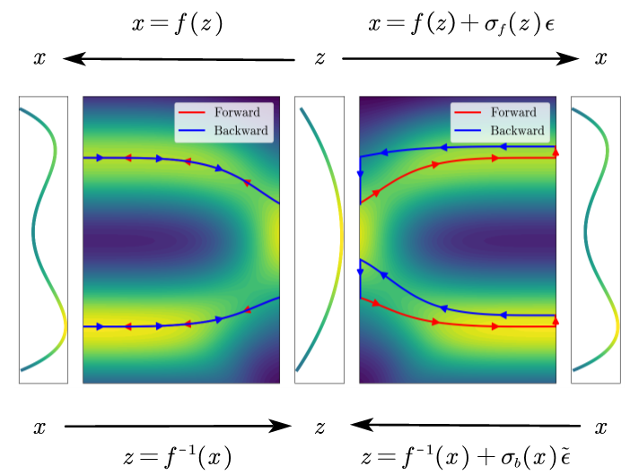

# Flow_Perturbation
We introduce the flow perturbation method, which incorporates optimized stochastic perturbations into the flow. By reweighting trajectories generated by the perturbed flow, our method achieves
unbiased sampling of the Boltzmann distribution with orders of magnitude speedup compared to both brute force
Jacobian calculations and the Hutchinson estimator. 



Publication
-----------
Please find the arxiv preprint here:
[https://arxiv.org/abs/2002.06707](https://arxiv.org/abs/2407.10666)

Citation update is coming up...
```
@article{peng2024flow,
  title={Flow Perturbation to Accelerate Unbiased Sampling of Boltzmann distribution},
  author={Peng, Xin and Gao, Ang},
  journal={arXiv preprint arXiv:2407.10666},
  year={2024}
}
```
***
# Dependencies
* Mandatory
  * [pytorch>=2.0](https://github.com/pytorch/pytorch)
  * [numpy](https://github.com/numpy/numpy)
  * [bgmol](https://github.com/noegroup/bgmol) (for  Chignolin)
  * [bgflow](https://github.com/noegroup/bgmol) (for  Chignolin)
  * [mdtraj=1.9.9](https://github.com/mdtraj/mdtraj) (for  Chignolin)

## Training
* All hyper-parameters and training details are provided in config files (), and free feel to tune these parameters../configs/*.yml
  
```bash
python train.py ./configs/GMM10D_default.yml ./models/GMM10D\ 
python train.py ./configs/GMM1000D_default.yml ./models/GMM1000D\ 
python train.py ./configs/CGN_default.yml ./models/CGN\ 
...
```
* The model checkpoints will be saved in the specified directory,e.g., ./models/GMM10D

# Metropolis Monte Carlo (MC) simulations
* The Metropolis MC simulations are provided in the following files:

```bash
python MC.py ./configs/CGN_default.yml ./models/CGN --method 0 --eps_type Rademacher\ 
```
```
* The first argument specifies the configuration file, while the second argument indicates the model directory. The --method option determines the approach for running the Monte Carlo (MC) simulations:
0: Flow Perturbation (FP)
-1: Jacobian-based method
-2: Stochastic Normalizing Flow (SNF)
1-n: Hutchinson trace estimator
The --eps_type parameter defines the type of perturbation to use, such as Rademacher, Gaussian, etc.

## Sequential Monte Carlo (SMC)

```bash
python SMC.py ./configs/GMM10D_default.yml ./models/GMM10D --method 0 --eps_type Rademacher\ 
python SMC.py ./configs/GMM1000D_default.yml ./models/GMM1000D --method 0 --eps_type Rademacher\ 
python SMC.py ./configs/CGN_default.yml ./models/CGN --method 0 --eps_type Rademacher\ 
'''
```
* The first argument specifies the configuration file, while the second argument indicates the model directory. The --method option determines the approach for running the Monte Carlo (MC) simulations:
0: Flow Perturbation (FP)
-1: Jacobian-based method
-2: Stochastic Normalizing Flow (SNF)
1-n: Hutchinson trace estimator
The --eps_type parameter defines the type of perturbation to use, such as Rademacher, Gaussian, etc.


## Model and data
* We provide all pre-trained model checkpoints and the result datasets presented in the paper. The resources are hosted on Hugging Face:
  * [Result Folder](https://huggingface.co/XinPeng76/Flow_Perturbation)


## [License](#dependencies)
[MIT License](LICENSE)
